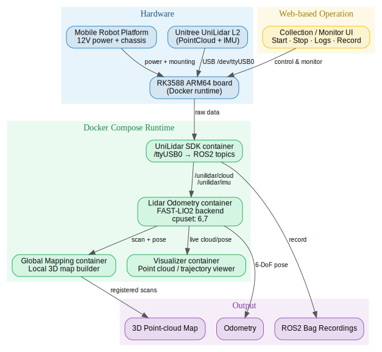
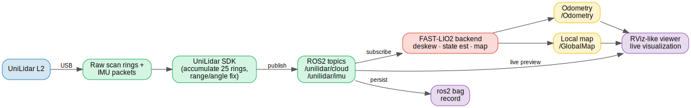

# UniLidar SDK Mapping

Run LiDAR-Inertial Odometry on RK3588 with Unitree UniLidar L2.

This repository provides a lightweight deployment package for running UniLidar L2 data acquisition and LiDAR-Inertial Odometry on an ARM64 embedded platform, especially RK3588-based boards. It is designed for mobile robot mapping experiments using a low-cost 3D mechanical scanning LiDAR.

The project focuses on making the full mapping pipeline easy to deploy, start, monitor, and debug on an embedded device.

## Overview

UniLidar L2 is a compact 3D LiDAR that outputs point cloud and IMU data. In this project, the LiDAR is connected to an RK3588 computing board, and the mapping pipeline runs locally on the embedded device.



The system is intended for real robot data collection and mapping experiments, including:

* UniLidar L2 data acquisition
* ROS / ROS2-based point cloud and IMU streaming
* LiDAR-Inertial Odometry mapping
* Embedded deployment on RK3588 ARM64
* Docker-based runtime environment
* CPU frequency control for stable performance
* Web-based data collection and monitoring workflow

## Hardware Setup

The typical hardware setup is:

```text
UniLidar L2
    ↓
RK3588 ARM64 board
    ↓
LiDAR SDK / Mapping runtime
    ↓
Point cloud + IMU data
    ↓
LiDAR-Inertial Odometry
    ↓
Real-time mapping result
```

In my test setup, the RK3588 board is mounted on a mobile robot platform. The LiDAR is fixed on the robot and connected directly to the RK3588 board. The robot uses a 12V electric chassis as the mobile base.

## Why This Project

Directly running LiDAR mapping on embedded platforms can be inconvenient. Typical issues include:

* Complicated dependency installation
* Different ARM64 runtime environments
* Unstable CPU frequency under load
* Hard-to-debug LiDAR driver startup
* Difficult remote operation on a mobile robot
* Repeated manual commands during data collection

This repository tries to simplify the deployment process by packaging the mapping runtime and providing helper scripts for ARM64 boards.

## Repository Structure

```text
UniLidar-SDK-Mapping/
├── docker_compose/
│   └── Docker Compose runtime files
├── download_arm64_app_package.sh
├── set_cpu_freq_max.sh
├── check_current_cpu_freq.sh
├── README.md
└── .gitignore
```

### Main scripts

| Script                          | Description                                                 |
| ------------------------------- | ----------------------------------------------------------- |
| `download_arm64_app_package.sh` | Download and extract the ARM64 mapping runtime package      |
| `set_cpu_freq_max.sh`           | Set CPU frequency to maximum for stable mapping performance |
| `check_current_cpu_freq.sh`     | Check current CPU frequency on the embedded board           |

## Quick Start

### 1. Clone the repository

```bash
git clone https://github.com/MapMindAI/UniLidar-SDK-Mapping.git
cd UniLidar-SDK-Mapping
```

### 2. Download the ARM64 mapping package

```bash
bash download_arm64_app_package.sh
```

This will download the prebuilt mapping package and extract it into the local `mapping/` directory.

### 3. Check CPU frequency

```bash
bash check_current_cpu_freq.sh
```

For real-time LiDAR mapping, it is recommended to keep the CPU running at maximum frequency.

### 4. Set CPU frequency to maximum

```bash
sudo bash set_cpu_freq_max.sh
```

This helps reduce frame drops, mapping instability, and latency spikes on embedded devices.

### 5. Start the mapping runtime

If you are using Docker Compose, enter the Docker Compose directory and start the services:

```bash
cd docker_compose
docker compose up -d
```

Check running containers:

```bash
docker ps
```

View logs:

```bash
docker logs -f <container_name>
```

Replace `<container_name>` with the actual container name shown by `docker ps`.

## LiDAR Connection

Before starting the mapping program, make sure the UniLidar device is connected and visible on the system.

Check serial devices:

```bash
ls /dev/ttyUSB*
```

A typical device path is:

```text
/dev/ttyUSB0
```

If your LiDAR appears as a different device, update the corresponding configuration file or launch command.

You may also need to grant permission:

```bash
sudo chmod 666 /dev/ttyUSB0
```

For a more permanent setup, configure udev rules for the LiDAR device.

## Runtime Data Flow

The runtime pipeline is shown below:



```text
UniLidar L2
    ↓ raw data
UniLidar SDK
    ↓
PointCloud2 + IMU
    ↓
LIO mapping backend
    ↓
Odometry + map
    ↓
Visualization / recording / web monitoring
```

The mapping backend uses the LiDAR point cloud and IMU stream to estimate robot motion and build a local 3D map.

## Recommended RK3588 Settings

For better real-time performance:

1. Use a stable power supply.
2. Set CPU frequency to maximum.
3. Avoid running unnecessary background processes.
4. Use a high-quality USB cable for the LiDAR.
5. Make sure the LiDAR is rigidly mounted.
6. Keep the LiDAR and IMU timestamp stream stable.
7. Monitor CPU temperature during long mapping sessions.

Check CPU frequency:

```bash
bash check_current_cpu_freq.sh
```

Set maximum frequency:

```bash
sudo bash set_cpu_freq_max.sh
```

## Web-Based Collection Workflow

This project is designed to work with a web-based data collection and monitoring workflow.

The web frontend can be used to:

* Start or stop the UniLidar mapping service
* Check container status
* Refresh runtime logs
* Monitor whether the LiDAR process is running correctly
* Trigger data recording or upload
* Simplify repeated experiments on a mobile robot

This is useful when the RK3588 board is installed on a moving robot, where directly operating a terminal is inconvenient.

## Mapping Notes

For good mapping results, the following factors are important:

### 1. Rigid sensor mounting

The LiDAR must be firmly mounted on the robot. Any vibration or mechanical looseness will directly affect the point cloud and odometry quality.

### 2. Stable power

The RK3588 board and LiDAR should use a stable power source. Voltage drops may cause data loss, USB disconnects, or runtime crashes.

### 3. Correct LiDAR orientation

Make sure the coordinate frame used by the mapping backend matches the actual LiDAR mounting direction.

### 4. CPU performance

LiDAR-Inertial Odometry is sensitive to processing latency. On embedded boards, CPU frequency scaling may cause unstable runtime behavior. Setting the CPU frequency to maximum is recommended.

### 5. Point cloud quality

If the raw point cloud contains strong geometric distortion, the mapping result will also degrade. Always inspect the raw point cloud before tuning the LIO parameters.

## Troubleshooting

### Cannot find LiDAR device

Check:

```bash
ls /dev/ttyUSB*
```

If no device appears:

* Reconnect the LiDAR
* Check USB cable
* Check power supply
* Check `dmesg`

```bash
dmesg | tail -n 50
```

### Permission denied on `/dev/ttyUSB0`

Run:

```bash
sudo chmod 666 /dev/ttyUSB0
```

Or configure udev rules.

### Mapping is slow or unstable

Try:

```bash
sudo bash set_cpu_freq_max.sh
```

Also check:

```bash
top
htop
```

Make sure the RK3588 board is not thermally throttling.

### Docker container is not running

Check containers:

```bash
docker ps -a
```

View logs:

```bash
docker logs -f <container_name>
```

Restart services:

```bash
cd docker_compose
docker compose restart
```

### Point cloud appears distorted

Possible causes:

* Incorrect LiDAR coordinate frame
* Wrong sensor mounting direction
* Poor mechanical fixation
* Timestamp issue
* UniLidar intrinsic calibration error
* Motion distortion without proper deskew

Inspect the raw point cloud before changing LIO parameters.

## Future Work

Planned improvements:

* Add clearer launch scripts for different RK3588 boards
* Add web frontend documentation
* Add example mapping videos and screenshots
* Add UniLidar L2 calibration tools
* Add rosbag recording examples
* Add Fast-LIO configuration notes
* Add benchmark results on RK3588
* Add automatic startup service for robot deployment

## Related Projects

* UniLidar SDK
* Fast-LIO / Fast-LIO2
* ROS / ROS2
* RK3588 embedded robotics platform

## License

Please check the licenses of the included third-party components, including the UniLidar SDK and the LIO backend. This repository is intended for research, development, and robotics prototyping.

## Acknowledgements

This project is built for low-cost mobile robot mapping experiments using UniLidar L2 and RK3588. Thanks to the open-source robotics and SLAM communities.
