# Lidar-Inertial Odometry Filter

This module implements a tightly-coupled **Lidar-Inertial Odometry (LIO)** front-end. It fuses
high-rate IMU predictions, sparse lidar geometric features, and an optional visual-inertial
tracker into a single, consistent state estimate. The architecture is modular: the filter
orchestrates feature extraction, point-to-map registration, and an iterated Kalman-filter
backend.

---

## 1. High-level pipeline

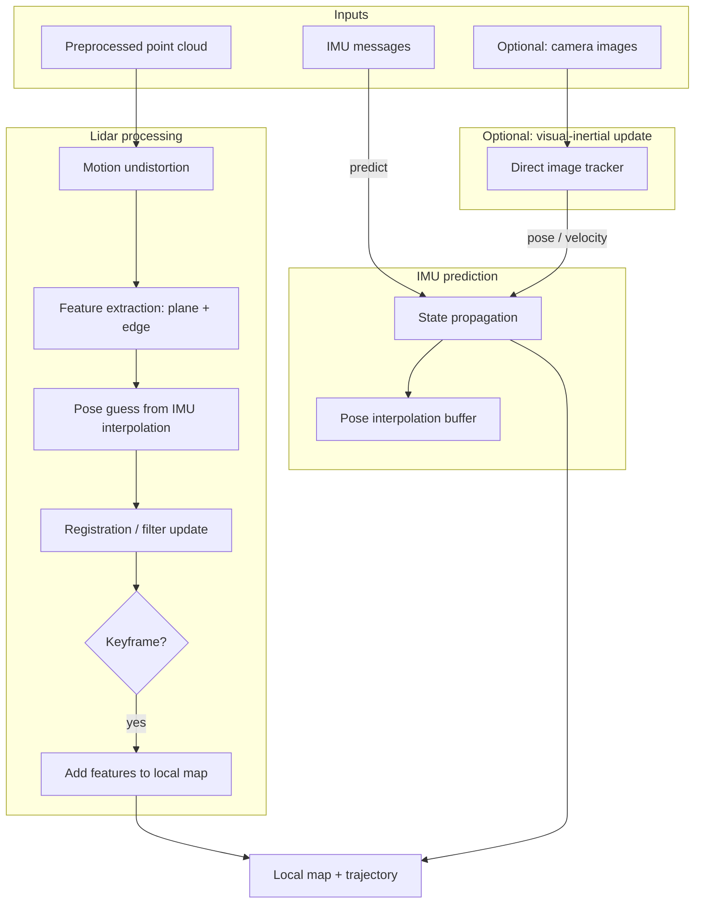

---

## 2. Core concepts

### Processed lidar sweep

A processed sweep stores:

| Quantity | Meaning |
|---|---|
| Timestamp | Sweep time. |
| Pose | Rigid body-to-world transform. |
| Plane points | Points classified as locally planar. |
| Edge points | Points classified as locally edge-like. |
| Per-point timestamps | Capture time of each point, used for motion undistortion. |

### Configuration knobs

The filter exposes three groups of settings:

* **Feature extraction**: sliding-window size, number of rings used, dynamic-window policy for
  different lidar types.
* **Registration**: nearest-neighbour count, search radius, voxel resolution for the plane/edge
  maps, and Gauss-Newton / iterated-update parameters.
* **Tracking policy**: extrinsic transform from lidar/base to IMU, keyframe distance/rotation
  thresholds, local map range, and IMU propagation method.

---

## 3. Algorithm details

### 3.1 Initialization

On the first lidar sweep the system:

1. Extracts plane and edge features.
2. Uses the initial body-to-world guess as the world origin.
3. Inserts those features into two incremental voxel maps: one for planes and one for edges.
4. Leaves the inertial filter in an initialization state until enough motion has been
   observed.

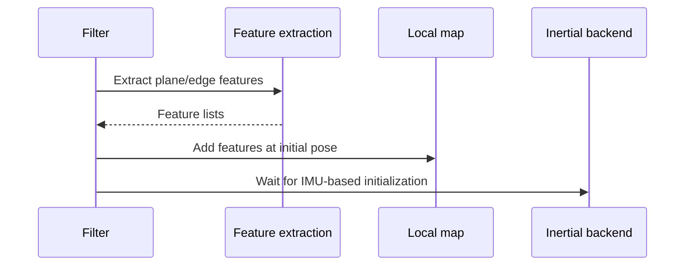

### 3.2 IMU processing

Each IMU sample is forwarded to the inertial backend:

* During initialization, gyroscope integration gives a yaw-only rotation; translation is
  assumed zero.
* During normal operation, the IMU drives the error-state Kalman prediction step and feeds a
  pose interpolation queue used for motion undistortion.

If visual tracking is enabled, IMU data is also forwarded to the visual tracker.

### 3.3 Motion undistortion

A scanning lidar sweep is not captured instantaneously. Each point was observed at a slightly
different body pose. The filter compensates by transforming every point to the current filter
time using interpolated body poses.

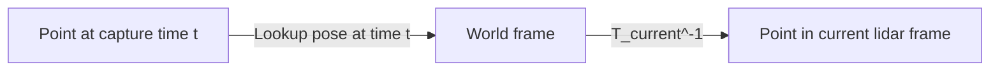

Three flavours are supported:

| Mode | Description |
|---|---|
| Whole-cloud demotion | Assumes all scan rings share the same column timestamp; one interpolation per column. |
| Per-ring demotion | Each ring is undistorted independently; can run in parallel. |
| Feature-only demotion | Only the extracted plane/edge points are undistorted, trading accuracy for speed. |

Pose interpolation uses **linear translation** and an **angular-velocity exponential map**
for rotation.

### 3.4 Feature extraction

The extractor takes a ring-ordered point cloud and classifies each point as planar, edge-like,
or unused.

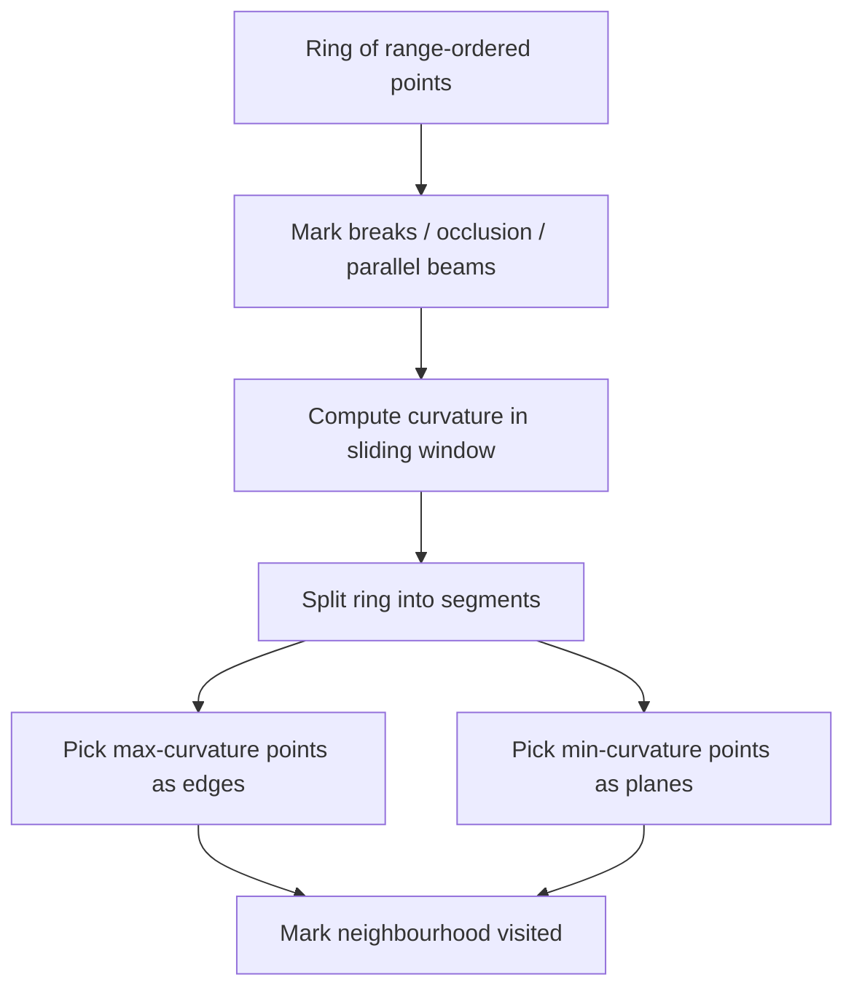

* **Curvature** for point \(i\):

  $$
  c_i = \frac{\left|\sum_{j \in \mathcal{W}_i} (r_j - r_i)\right|}{w}
  $$

  where \(r_j\) are neighbouring range measurements and \(w\) is the half-window size.

* **Break detection**: neighbouring points with a large range jump are marked as occluded and
  excluded.
* **Angle break** (optional): large angles between adjacent beams are treated as depth
  discontinuities.
* **Segmentation**: each ring is split into segments. The highest-curvature points become
  edges, the lowest-curvature points become planes, with a cap on the number of edge points
  per segment.
* **Dynamic window**: for some lidar types the window size shrinks with distance to keep the
  spatial support roughly constant.

### 3.5 Point-to-map registration

The local map is stored in two incremental voxel KD-trees:

* Plane map with coarser voxel size.
* Edge map with finer voxel size.

For each incoming frame the matcher performs nearest-neighbour matching:

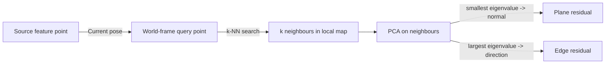

* **Plane residual**: the signed distance from the transformed point to the local plane:

  $$
  r_{\text{plane}} = \mathbf{n}^{\top} \left( \mathbf{R} \mathbf{p} + \mathbf{t} - \mathbf{q} \right)
  $$

* **Edge residual**: the perpendicular distance from the transformed point to the local line:

  $$
  \mathbf{r}_{\text{edge}} = \mathbf{d} \times \left( \mathbf{R} \mathbf{p} + \mathbf{t} - \mathbf{q} \right)
  $$

  where \(\mathbf{n}\) is the plane normal, \(\mathbf{d}\) is the edge direction, \(\mathbf{p}\)
  is the source point, \((\mathbf{R}, \mathbf{t})\) is the current pose, and \(\mathbf{q}\) is
  the local centroid.

An edge match is accepted only when the largest eigenvalue is sufficiently bigger than the
middle eigenvalue, ensuring a line-like neighbourhood.

Two registration paths exist:

1. **Direct Gauss-Newton optimization**: used only during initialization. A fixed number of
   iterations minimize plane + edge residuals with a Huber loss.
2. **Iterated Kalman-filter measurement update**: used in normal operation. The matcher builds
   residuals and passes them to the inertial backend as a shared measurement model.

### 3.6 Iterated Kalman-filter state update

The inertial backend is an **Iterated Extended Kalman Filter on Manifolds**. The full state
has 23 degrees of freedom:

| Component | Dimension | Description |
|---|---|---|
| Position | 3 | Body position in world |
| Orientation | 3 (SO3) | Body orientation in world |
| Lidar-to-body translation | 3 | Extrinsic translation |
| Lidar-to-body rotation | 3 (SO3) | Extrinsic rotation |
| Velocity | 3 | Body velocity |
| Gyroscope bias | 3 | IMU gyro bias |
| Accelerometer bias | 3 | IMU accel bias |
| Gravity | 2 (on S2) | Gravity direction |

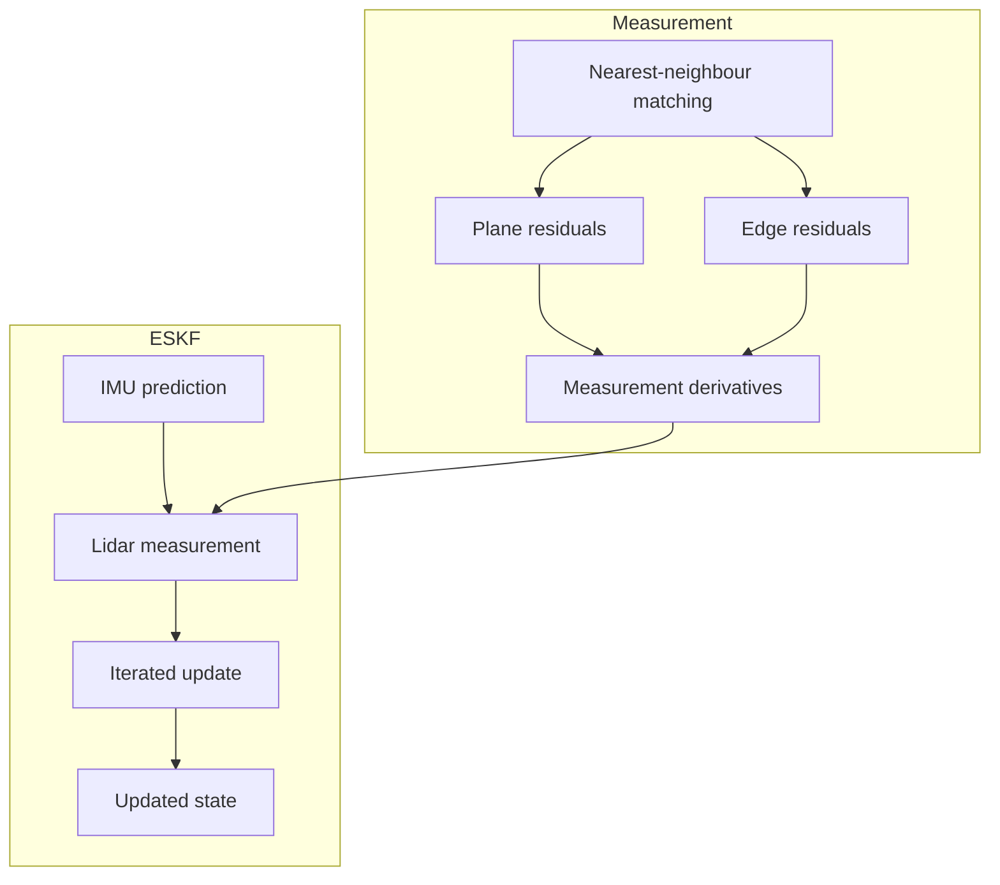

The lidar update is called with an isotropic point covariance. After the update, the system
can optionally re-absorb accelerometer bias into the gravity estimate to prevent gravity
direction drift.

### 3.7 Keyframe management and local map

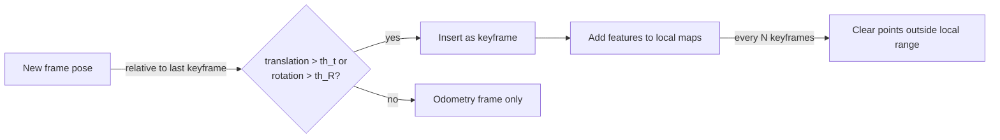

The local map is bounded by a configurable range. Every fixed number of keyframes, far-away
boxes are deleted from both maps. If visualization is enabled, the map points are copied out
under a mutex for rendering.

### 3.8 Optional visual-inertial update

If valid camera intrinsics are provided, a direct image tracker is instantiated. After the
LIO system has stabilized, each image goes through:

1. Propagate the IMU state to the image timestamp.
2. Run direct image tracking.
3. Feed back the estimated camera pose and/or local velocity as additional measurements.
4. Update the tracker with the latest fused pose and covariance.

The tracker also receives local lidar points to bootstrap and validate image depths.

---

## 4. Coordinate frames

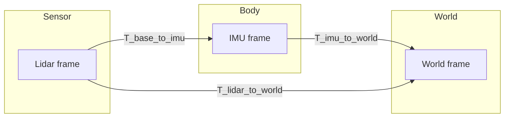

The extrinsic transform maps the lidar/base frame to the IMU frame. The lidar pose in world
is obtained by chaining the IMU pose with this extrinsic transform.

---

## 5. Failure handling

| Failure | Behaviour |
|---|---|
| Registration fails during initialization | Reset and restart from the next frame. |
| Too few matches in normal mode | Reset; the system re-initializes. |
| Large time gap between sweeps | A warning is logged; processing continues. |

---

## 6. Performance notes

* Detailed timing breakdowns can be enabled at runtime: demotion, feature extraction, pose
  guess, registration, map update, and image update.
* Multi-threading is used in feature extraction (per ring), nearest-neighbour matching
  (plane points split across workers), and per-ring demotion.
* Nearest-neighbour matches can be cached across the iterated updates of the same frame when
  the pose changes only slightly.
* The incremental KD-tree can run in a safe mode that waits for background rebuilds, at the
  cost of some throughput.

---

## 7. Accelerations & implementation refinements

The implementation contains several optimizations and robustness improvements over a
straightforward LIO baseline.

### 7.1 Multi-threaded processing

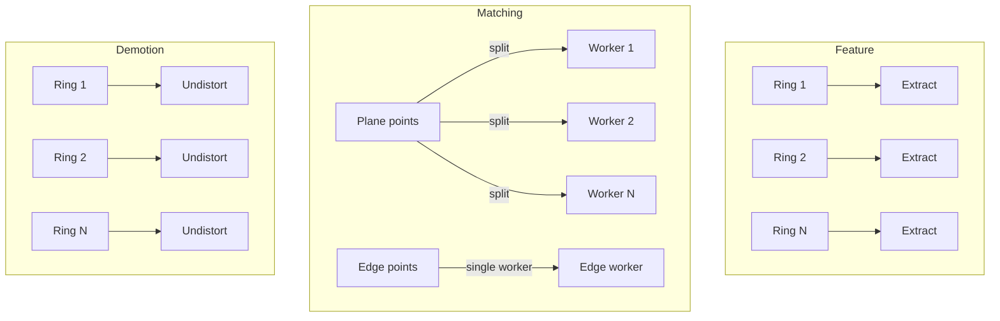

* **Feature extraction**: each ring is processed independently in parallel. This is natural
  because curvature and segmentation are ring-local operations.
* **Point-to-map matching**: plane points are partitioned into chunks and matched concurrently,
  while edge matching runs on a dedicated worker. The final factor lists are concatenated.
* **Demotion**: in per-ring mode, rings are undistorted in parallel, which is important for
  dense or non-uniform scanners.

### 7.2 Incremental KD-Tree refinements

The incremental KD-Tree that backs the local map was refined in three ways:

1. **Fast nearest-neighbour search for small `k`**. For the typical case of finding the 5
   nearest neighbours, the search uses a fixed-size candidate buffer instead of a heap. This
   avoids dynamic allocation and cache-unfriendly heap operations during the tree traversal.
   For larger `k` it falls back to the heap-based path.

2. **Distance computations**. Squared point-to-point and point-to-box distances are implemented
   with branch-friendly scalar code and, on ARM, vectorized with NEON instructions for the
   horizontal part of the computation.

3. **Voxel downsampling policy**. When a new point falls into an occupied voxel, the tree keeps
   the point that is closest to the voxel centre rather than simply keeping the first point.
   This produces a more geometrically balanced map representation, especially when points are
   inserted in scan order.

A safe mode is also available that waits for any ongoing background tree rebuild before
querying, which makes benchmarking deterministic at the cost of lower throughput.

### 7.3 Match caching inside the matcher

The iterated Kalman-filter update calls the measurement model several times for the same lidar
frame. The pose changes only slightly between iterations, so the nearest neighbours and the
resulting plane/edge factors can be reused.

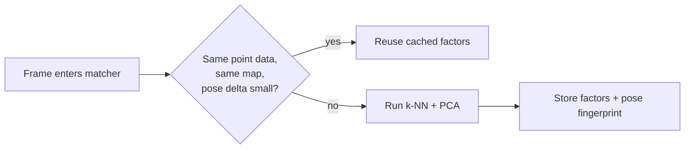

The cache is invalidated whenever the local map is modified (point insertion or deletion) or
when the point data changes. The pose delta check uses small translation and rotation
thresholds; these thresholds can be relaxed in aggressive speed modes.

### 7.4 Motion-undistortion refinements

* **Per-ring timestamps**: rather than assuming all rings share one column timestamp, each ring
  can carry its own timestamp vector. This is essential for scanners whose rings are not
  perfectly synchronized.
* **Feature-only undistortion**: instead of undistorting the entire dense cloud, only the
  extracted plane and edge points are undistorted. This cuts CPU usage with little impact on
  registration accuracy.
* **Interpolation buffer with angular velocity**: rotation interpolation uses the integrated
  angular velocity at each buffered pose, giving better extrapolation when the queried time is
  slightly outside the buffered interval.

---

## 8. UniLiDAR integration

A dedicated ROS driver node was added for the Unitree UniLiDAR. It adapts the generic LIO
pipeline to the sensor's packet format and characteristics.

### 8.1 Sensor-specific preprocessing

* **25-ring scans**: the UniLiDAR produces 25 rings, so the point cloud preprocessor is
  configured with the correct ring count and the per-ring reserve size is computed from the
  actual message size.
* **Range limits**: the working range is clamped to a short radius suited to the sensor
  (e.g., 15–25 m depending on the speed mode).
* **IMU intrinsics**: noise and random-walk values are tuned for the UniLiDAR's built-in IMU.

### 8.2 UniLiDAR-specific pipeline settings

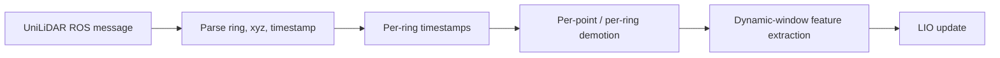

* **Per-point timestamps**: each point carries its own capture time, so demotion is performed
  per point rather than per column.
* **Per-ring demotion**: rings are undistorted independently and in parallel.
* **Dynamic window in feature extraction**: the curvature window shrinks with range to account
  for the sensor's non-uniform angular density.
* **Zero-velocity initialization**: the system can be told to start from standstill. The
  initial velocity is forced to zero and the relative translation of the first registration is
  also zeroed, which is useful for hand-held or slow-start scenarios.

### 8.3 Acceleration levels

The UniLiDAR node exposes acceleration levels that trade accuracy for speed:

| Level | Behaviour |
|---|---|
| 0 | Default quality. |
| 1 | Enables nearest-neighbour match caching inside the matcher. |
| 2 | Looser cache thresholds, feature-only demotion, smaller curvature window, reduced local map range, and shorter maximum range. |

These levels make it possible to run the filter on constrained compute (e.g., ARM boards or
embedded platforms) while still keeping the full-quality path available.

---

## 9. References

* The inertial backend and lidar measurement model follow the conventions from IKFoM / FAST-LIO.
* Plane/edge extraction follows the classical LOAM-style curvature-based segmentation.
* Incremental KD-Tree: iKD-Tree.
